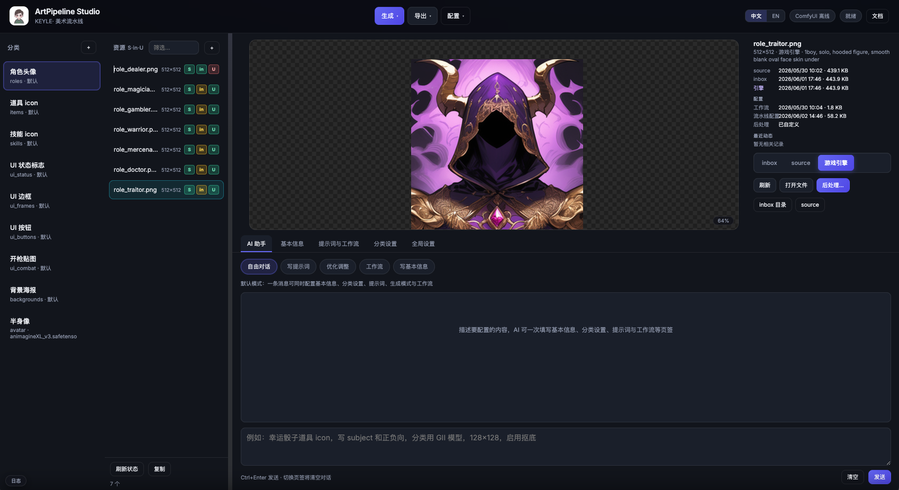
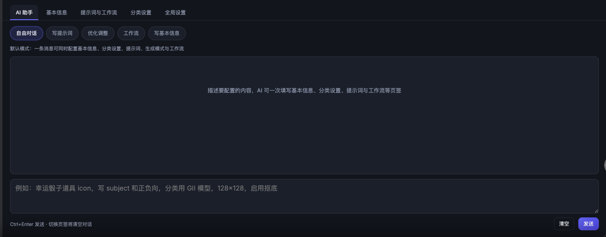
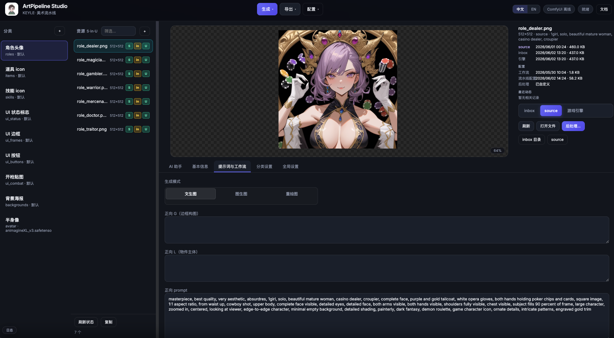
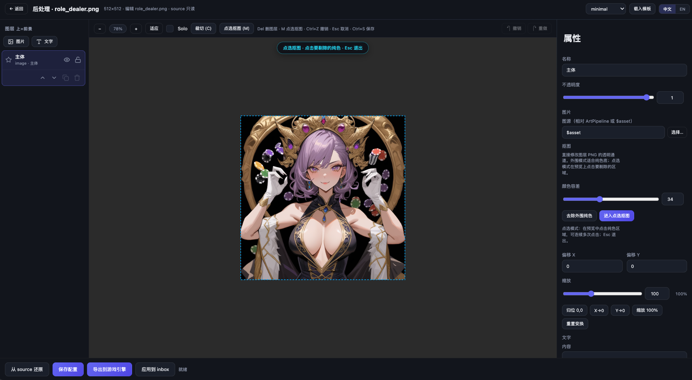
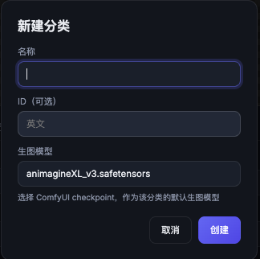
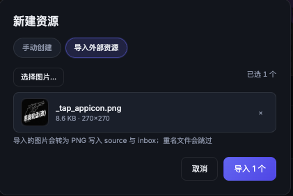
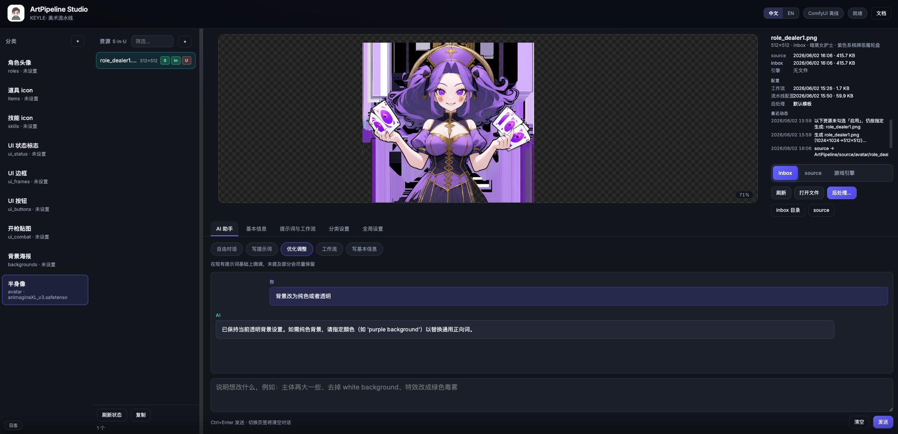
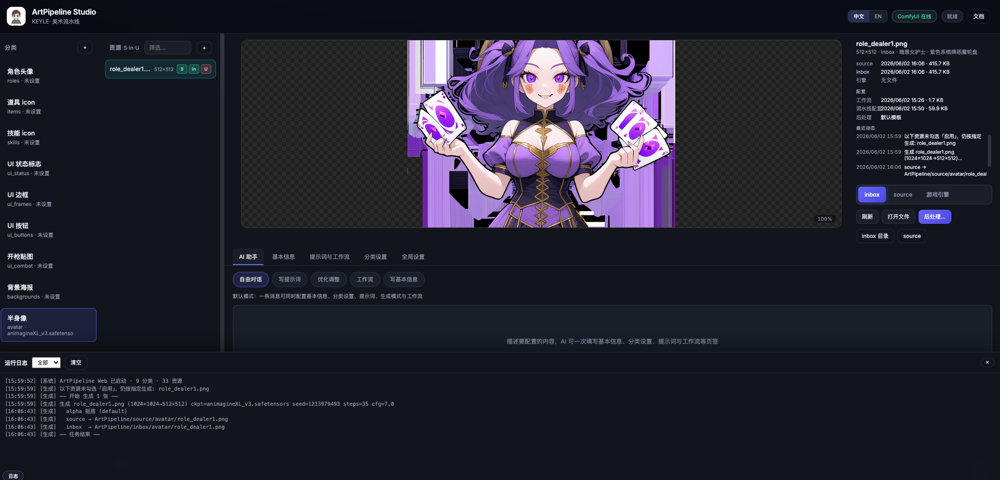

# KEYLE· ArtPipeline Studio

**ComfyUI 驱动的游戏美术流水线** — 从 AI 出图到 Unity 资源，一条链路搞定。

[](LICENSE)
[](https://github.com/KeyleXiao/ArtPipeline-Studio-/actions/workflows/build-release.yml)
[](https://github.com/KeyleXiao/ArtPipeline-Studio-/releases/latest)

> 产品主页：[art.vrast.cn](https://art.vrast.cn) · 使用文档：[art.vrast.cn/docs.html](https://art.vrast.cn/docs.html)

<p align="center">
  
</p>

<p align="center"><sub>主工作台 — 分类 · 资源 · S·in·U 状态 · AI 助手 · 多源预览</sub></p>

---

## 简介

ArtPipeline Studio 面向 **UI 图标 / 角色头像 / 道具** 等 2D 美术资源的批量生产，串联：

```
ComfyUI 生成 → source 原图 → inbox 后处理 → 游戏引擎目录
```

- **Web 版**：FastAPI + 静态前端，浏览器调试方便  
- **桌面版**：macOS `.app` / Windows `.exe` 独立运行（PyInstaller）  
- **AI 助手**：DeepSeek 写提示词、优化与工作流建议  
- **后处理**：PS 式图层栈，仅改 inbox，source 只读  

---

## 功能一览

| 能力 | 说明 |
|------|------|
| 分类与资源库 | 多分类、搜索、新建 / 重命名 / 删除；**S·in·U** 三态路径追踪 |
| **导入外部资源** | 新建资源对话框支持多选 PNG/JPG/WebP，按文件名批量创建并写入 source + inbox |
| Checkpoint 分层 | 分类级默认模型；单资源可在基本信息覆盖；ComfyUI URL 拉取模型列表 |
| ComfyUI 批量 | 生成选中 / 本类 / 生成并导出；浮动进度，可停止；右键可对单个资源生图 |
| img2img 重绘 | 基于 inbox 或 source 继续生成，denoise 可调 |
| 提示词与工作流 | 每资源 subject、正/负向 prompt、独立 workflow JSON |
| 后处理编辑器 | 图层、裁切、文字、模板；写入 inbox 或导出引擎 |
| AI 助手 | 自由对话 / 写提示词 / 优化 / 工作流（需 DeepSeek Key）；自动保存对话 |
| 运行日志 | 抽屉实时查看；可配置日志目录，持久化写入 `studio.log` |
| 跨分类迁移 | 长按资源拖到其他分类，确认后移动三路径 PNG |
| 中 / EN | 界面双语 |

### S·in·U 状态块

| 块 | 绿 | 黄 | 红 / 灰 |
|----|----|----|---------|
| **S** source | 已生成 | — | 尚未生成 |
| **in** inbox | 与 source 一致 | 已后处理 | 缺失 |
| **U** 引擎 | 与 inbox 一致 | — | 需重新导出 |

---

## 界面截图

### 主工作台

分类与资源库、AI 助手（默认自由对话）、inbox 预览与 **S·in·U** 三态路径。顶部收纳生成、导出与全局设置。

<p align="center">
  
</p>

### 提示词与工作流

按资源编辑 subject、正向 / 负向 prompt；道具与技能支持 SDXL **G / L** 分层。工作流 JSON 可校验、保存与载入模板。

<p align="center">
  
</p>

### img2img 重绘

将 inbox 或 source 图作为参考，调节 denoise 在 ComfyUI 中继续迭代，适合头像与道具微调。

<p align="center">
  
</p>

### 后处理编辑器

PS 式图层栈：图片 / 文字、裁切、模板；实时合成预览。仅修改 inbox，source 只读；可一键导出 Unity。

<p align="center">
  
</p>

> 更多动效与说明见 [产品官网](https://art.vrast.cn#showcase)。

### 上手说明（图文）

<p align="center"><sub>新建分类 · 分类菜单 · 手动/导入资源 · 资源右键 · 生图配置 · 出图 · 运行日志</sub></p>

| | | |
|:---:|:---:|:---:|
| <br />新建分类 | <br />分类右键 | <br />手动新建 |
| <br />导入外部 | <br />资源右键 | <br />生图配置 |
| <br />提示词出图 | <br />运行日志 | |

官网首页 [#guide](https://art.vrast.cn/index.html#guide) 与 [在线文档](https://art.vrast.cn/docs.html) 含相同说明截图。

---

## 快速开始

### 环境要求

| 组件 | 说明 |
|------|------|
| Python 3.10+ | Web / 开发模式 |
| ComfyUI | 本地或局域网，默认 `http://127.0.0.1:8188` |
| 游戏项目 | 通常为 Unity；导出路径在「全局设置」配置 |

### 1. 安装依赖

```bash
git clone git@github.com:KeyleXiao/ArtPipeline-Studio-.git
cd ArtPipeline-Studio-
cd artApp
pip install -r requirements.txt
```

### 2. 初始化配置

```bash
cp ../tools/pipeline_config.example.json ../tools/pipeline_config.json
```

在应用 **「全局设置」** 中填写：

- **ComfyUI URL**（默认 `http://127.0.0.1:8188`，用于拉取 checkpoint 列表与提交生图）
- **ArtPipeline 根目录**（含 `source/`、`inbox/`、`workflows/` 的目录）
- **游戏项目根目录**
- **运行日志目录**（可选；留空则使用系统默认，日志写入 `studio.log`）
- **DeepSeek API Key**（使用 AI 助手时）

在 **「分类设置」** 中为每个分类选择 **Checkpoint**（生图模型）；单个资源可在 **「基本信息」** 中覆盖为独立模型（留空则跟随分类）。

> `pipeline_config.json` 含个人路径与密钥，**勿提交 Git**（已在 `.gitignore`）。

### 3. 启动 Web 版

```bash
python run_dev.py
```

浏览器打开 **http://127.0.0.1:8765**。

### 4. 推荐工作流

1. 配置分类通用 prompt + 各资源 subject  
2. 确认 ComfyUI 在线 → **生成本类**  
3. 需精修的资源进入 **后处理**  
4. **导出本类** 或 **生成并导出** 到 Unity  
5. 在引擎内验证资源  

更完整的操作说明见 [在线文档](https://art.vrast.cn/docs.html) 或仓库内 `artApp/web/docs/zh-CN.md`。

---

## 仓库结构

```
ArtPipeline-Studio/
├── artApp/                 # Web / 桌面壳（FastAPI + 前端）
│   ├── run_dev.py          # 浏览器开发入口
│   ├── run_app.py          # 桌面 pywebview 入口
│   ├── build_release_*.py  # macOS / Windows 打包
│   ├── sync_to_github.py   # 同步到本仓库（维护者）
│   └── web/                # 静态 UI、应用内文档
├── tools/                  # 配置、ComfyUI 客户端、后处理引擎
│   ├── pipeline_config.example.json
│   ├── config_manager.py
│   └── workflows/          # 工作流模板与每资源 JSON
├── docs/                   # 规范与模型说明（animagine-xl 等）
│   └── images/             # README / 官网用功能截图
├── comfyui/                # ComfyUI 相关参考
├── manifest/               # 资源清单
└── overlays/               # 后处理叠加素材
```

运行时还会在 **ArtPipeline 工作目录** 下使用（需自行创建或通过工具生成）：

```
your-art-workspace/
├── source/                 # ComfyUI 原图（只读）
├── inbox/                  # 后处理与合成输出
└── workflows/assets/       # 各资源工作流副本
```

---

## 桌面独立版

在对应平台打包，产物内嵌 Python，**无需**用户单独安装依赖。

| 平台 | 命令 | 产物 |
|------|------|------|
| macOS | `python3 build_release_mac.py` | `artApp/release/ArtPipeline Studio.app` |
| Windows | `python build_release_win.py` | `artApp/release/ArtPipeline Studio/` |

首次启动配置目录：

- macOS：`~/Library/Application Support/ArtPipeline Studio/`
- Windows：`%LOCALAPPDATA%\ArtPipeline Studio\`

运行日志（`studio.log`）默认目录：

- macOS：`~/Library/Logs/ArtPipeline Studio/`
- Windows：`%LOCALAPPDATA%\ArtPipeline Studio\Logs\`

可在应用 **全局设置** 中修改日志目录。

### 下载桌面版（Latest Release）

[](https://github.com/KeyleXiao/ArtPipeline-Studio-/actions/workflows/build-release.yml)

| 平台 | 直接下载 |
|------|----------|
| **macOS** | [ArtPipeline-Studio-macOS.zip](https://github.com/KeyleXiao/ArtPipeline-Studio-/releases/latest/download/ArtPipeline-Studio-macOS.zip) |
| **Windows** | [ArtPipeline-Studio-Windows.zip](https://github.com/KeyleXiao/ArtPipeline-Studio-/releases/latest/download/ArtPipeline-Studio-Windows.zip) |

[查看所有版本 · Releases](https://github.com/KeyleXiao/ArtPipeline-Studio-/releases/latest)

push 到 `main` 且 CI 成功后，会自动更新 **Latest Release**（固定 tag `latest-desktop`），首页与上表链接始终指向最新包。

### 从 GitHub Actions 下载（macOS）

1. 下载产物 **`ArtPipeline-Studio-macOS.zip`**，解压得到 **`ArtPipeline Studio.app`**
2. 双击启动；若提示无法验证：**右键 → 打开** → 确认
3. **不要**在终端运行 `Downloads/Contents/MacOS/...` — 缺少完整 bundle 会报 `Failed to load Python shared library`

CI 使用 `ditto` 打 zip 以保留 PyInstaller 符号链接；旧版直接上传 `.app` 目录会导致 Python 运行时丢失。

**在 Mac 上打 Windows 包**：PyInstaller 无法交叉编译，可用 GitHub Actions（`.github/workflows/build-release.yml`，并行构建 Windows + macOS）或在 Windows / 虚拟机中执行 `build_release_win.py`。

---

## 推荐模型

| 用途 | Checkpoint | 说明 |
|------|------------|------|
| 角色、道具、UI 图标 | **animagineXL_v3.safetensors** | 二次元卡牌风 |

详见 [docs/animagine-xl.md](docs/animagine-xl.md)。

---

## 文档

| 文档 | 位置 |
|------|------|
| 官网与截图 | [art.vrast.cn](https://art.vrast.cn) |
| 在线使用文档 | [art.vrast.cn/docs.html](https://art.vrast.cn/docs.html) |
| 应用内 Markdown | [artApp/web/docs/zh-CN.md](artApp/web/docs/zh-CN.md) |
| 近期更新 | [docs/更新日志.md](docs/更新日志.md) |
| artApp 开发说明 | [artApp/README.md](artApp/README.md) |
| 工具与 CLI | [tools/README.md](tools/README.md) |
| 目录规范 | [docs/目录说明.md](docs/目录说明.md) |

---

## 旧版 Tk / 命令行

仍可使用 Tk 界面或 CLI（与 Web 共用 `pipeline_config.json`）：

```bash
python tools/artTool_ui.py
python tools/cli.py --list
```

Web 版已覆盖主流程；Tk 可作为边缘功能回退。

---

## 参与与同步（维护者）

从本地完整工程同步到本仓库（自动脱敏密钥、排除 `release/` 与美术 PNG）：

```bash
cd /path/to/ArtPipeline/artApp
python3 sync_to_github.py --dest ~/ArtPipeline-Studio
```

---

## License

见 [LICENSE](LICENSE)。

---

**KEYLE · ArtPipeline Studio** — 游戏美术 AI 流水线

---

<!-- ArtPipeline 项目说明 -->

# 美术资源流水线（ArtPipeline）

项目根目录下的 **AI 美术工作区**：生成原图、待入库文件、文档与 ComfyUI 工作流集中放这里，再部署到 `Assets/Resources/`。

## 目录一览

```
ArtPipeline/
├── README.md                 # 本文件
├── docs/                     # 规范与操作说明
├── manifest/                 # 资源清单（文件名、尺寸、prompt）
├── source/                   # ComfyUI 原始输出（按分类，可多版本）
│   ├── roles/
│   ├── items/
│   └── ui/
├── inbox/                    # 选定待入库（文件名必须与 Unity 一致）
│   ├── roles/
│   ├── items/
│   └── ui/
└── comfyui/                  # ComfyUI API 工作流
    └── workflows/
```

## 推荐模型

| 用途 | Checkpoint | 说明 |
|------|------------|------|
| 角色头像、道具插画 | **animagineXL_v3.safetensors** | 二次元卡牌风，与本项目 HUD 气质接近 |

详见 [docs/animagine-xl.md](docs/animagine-xl.md)。

## 一键生成（脚本 / GUI）

**推荐 GUI：**

```bash
python3 ArtPipeline/tools/artTool_ui.py
```

**命令行：**

```bash
python3 ArtPipeline/tools/cli.py --list
python3 ArtPipeline/tools/cli.py --category roles --to-inbox --deploy
# 旧路径仍可用
python3 Assets/Scripts/Tools/generate_icons_comfyui.py --kind role --to-inbox --deploy
```

配置与维护见 [tools/README.md](tools/README.md)、[tools/维护指南.md](tools/维护指南.md)。

## 工作流（ComfyUI → Unity）

1. 在 ComfyUI 用 **animagineXL_v3** 按清单生成，保存到 `source/<分类>/`（可保留多版 `role_warrior_v2.png` 等）。
2. 满意的一张 **复制/重命名** 为清单中的正式文件名，放入 `inbox/<分类>/`。
3. 入库 Unity Resources（直接复制，无裁切/抠图后处理）：

```bash
python3 Assets/Scripts/Tools/generate_icons_comfyui.py --kind role --to-inbox --deploy
# 或生成全部并入库
python3 Assets/Scripts/Tools/generate_icons_comfyui.py --all --to-inbox --deploy
```

旧版后处理脚本（裁切、去背景等）已移至项目根 `DeprecatedScripts/`。

## 与代码的对应关系

| inbox 路径 | Unity 目标 | 加载 |
|------------|------------|------|
| `inbox/roles/role_*.png` | `Assets/Resources/UI/Icons/Roles/` | `GameUiIconResources.GetRoleSprite` |
| `inbox/items/item_*.png` | `Assets/Resources/UI/Icons/Items/` | `GetItemSprite` |
| `inbox/ui/hp_heart_*.png` 等 | `Assets/Resources/UI/Icons/UI/` | `HpHeartFull` 等 |

## 关联文档

- [docs/目录说明.md](docs/目录说明.md)
- [docs/animagine-xl.md](docs/animagine-xl.md)
- `Assets/Scripts/表现优化文档.md` §7–§9（美术方向与分辨率）
- `Assets/Resources/UI/Icons/README.md`（Unity 导入设置）
