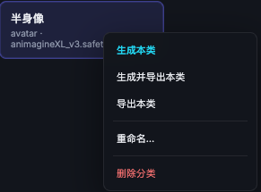
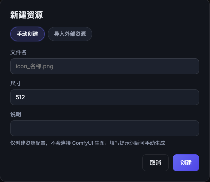
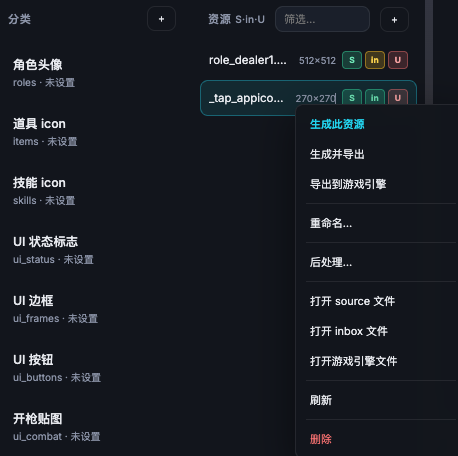
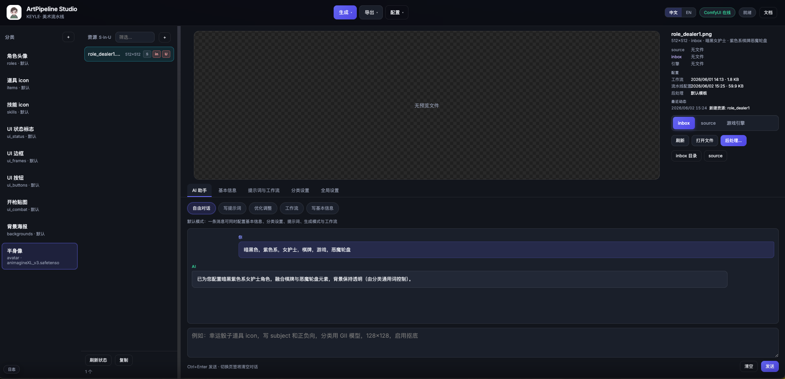

# ArtPipeline Studio 使用文档

> 在线文档：<https://art.vrast.cn>（如有部署）

## 简介

ArtPipeline Studio 是面向游戏美术资源的 Web 流水线工具，串联 **ComfyUI 生成 → source 原图 → inbox 编辑 → 游戏引擎目录** 的完整流程。支持批量生成、图层后处理、AI 提示词助手与配置管理。

## 工作环境

### 必需组件

| 组件 | 说明 |
|------|------|
| **ComfyUI** | 本地或局域网运行的 Stable Diffusion 推理服务，工具通过 HTTP API 提交工作流 |
| **ArtPipeline 目录** | 存放 source / inbox、工作流 JSON、后处理素材与配置 |
| **游戏引擎项目** | 通常为 Unity 项目；导出目标路径在「全局设置」中配置 |

### 推荐目录结构

```
ArtPipeline/
├── source/          # ComfyUI 生成原图（只读，后处理不修改）
├── inbox/           # 后处理工作副本与合成输出
├── workflows/       # 各资源的工作流 JSON
└── postprocess/     # 边框、背景等叠加素材

YourGame/
└── Assets/...       # 游戏引擎内最终资源路径
```

### 启动 Web 工具

```bash
cd ArtPipeline/artApp
python run_dev.py
```

浏览器访问终端提示的地址（默认 `http://127.0.0.1:8765`）。

## 功能概览

### 资源流水线

1. **生成**：ComfyUI 按工作流出图，写入 **source**
2. **后处理**（可选）：在 inbox 上叠图层、裁切、加字；**source 不会被修改**
3. **导出到游戏引擎**：将 inbox 文件复制到引擎项目目录

资源列表 **S·in·U** 状态块含义：

- **S (source)**：绿 = 已生成，灰 = 尚未生成
- **in (inbox)**：绿 = 与 source 一致，黄 = 已后处理，红 = 缺失
- **U (引擎)**：绿 = 与 inbox 一致，红 = 缺失或需重新导出

### 主界面操作

| 操作 | 说明 |
|------|------|
| 生成选中 / 生成本类 | 对选中或当前分类全部启用资源调用 ComfyUI |
| 生成并导出 | 生成完成后自动导出到游戏引擎 |
| 导出到游戏引擎 | 仅复制 inbox → 引擎目录（不重新生成） |
| 导出本类 | 导出当前分类下所有资源 |
| 后处理… | 打开图层编辑器，编辑 inbox 文件 |

预览区默认展示 **后处理合成结果**；无后处理配置时展示 inbox 原图。可切换 source / inbox / 引擎 路径查看各阶段文件。

### 新建与导入资源

点击资源列表 **+ 新建资源**，支持两种模式：

| 模式 | 说明 |
|------|------|
| **手动创建** | 填写文件名、尺寸与说明，仅创建配置（默认未启用，不会自动生图） |
| **导入外部资源** | 多选本地 PNG / JPG / WebP；列表可预览、单独移除；按文件名批量创建并写入 **source** 与 **inbox**（转为 PNG） |

导入时重名文件会跳过；适合把已有贴图快速纳入流水线管理。









右键资源可 **单独生图 / 生成并导出 / 导出**，无需资源处于启用状态。

### 运行日志

右下角 **日志** 按钮打开抽屉，按「全部 / 操作 / 生成 / 系统」筛选，支持 SSE 实时更新。

在 **全局设置 → 运行日志目录** 可指定日志落盘路径；留空时使用系统默认：

| 平台 | 默认目录 |
|------|----------|
| macOS | `~/Library/Logs/ArtPipeline Studio/` |
| Windows | `%LOCALAPPDATA%\ArtPipeline Studio\Logs\` |
| Linux | `~/.artpipeline-studio/logs/` |

日志文件为目录下的 **`studio.log`**，重启应用后会从文件尾部恢复最近记录。可点击 **打开目录** 在 Finder / 资源管理器中查看。




### AI 助手

四种模式：写提示词、优化调整、工作流、自由对话。需在「全局设置」配置 DeepSeek API Key。AI 可结合当前资源的分类、尺寸与已有 prompt 给出建议，部分模式下会直接写回配置。

### Checkpoint 配置

生图模型按 **分类 → 资源** 两级配置，全局设置只需填写 **ComfyUI URL** 即可拉取模型列表：

| 位置 | 作用 | 留空时 |
|------|------|--------|
| **分类设置** | 该分类下资源的默认 Checkpoint | 未设置，生图会提示配置 |
| **基本信息** | 单个资源可覆盖模型 | 跟随分类 |
| **全局设置** | ComfyUI URL、采样参数、**运行日志目录** 等 | — |

新建分类时需选择 Checkpoint；ComfyUI 离线时可手动输入已知模型文件名。

### 后处理编辑器

- 主体层 `$asset` 绑定 **inbox**，不修改 source
- **从 source 还原**：用 source 覆盖 inbox 并重置图层，重新开始编辑
- **应用到 inbox**：合成并写入 inbox
- **导出到游戏引擎**：保存后导出并返回主界面

## 最佳实践

### 1. 保持 source 干净

source 是 AI 生成的「母版」。后处理、裁切、加框等操作只在 **inbox** 进行。需要回到原始效果时使用「从 source 还原」。

### 2. 按分类组织

每个分类配置独立的 source/inbox/引擎路径、**Checkpoint** 与通用 prompt 前缀。道具、技能、头像等建议使用不同分类模板；个别资源可在「基本信息」单独指定模型。

### 3. 生成前检查

- ComfyUI 右上角 pill 显示「在线」
- **分类或资源已配置 Checkpoint**
- 资源已启用且工作流 JSON 有效
- 提示词与尺寸符合分类规范

### 4. 批量流程建议

1. 写好分类通用 prompt + 各资源 subject
2. **生成本类** → 检查 source / inbox 状态
3. 对需精修的资源进入 **后处理**
4. **导出本类** 或 **生成并导出** 同步到游戏引擎
5. 在引擎内刷新资源验证

### 5. 版本与协作

- 定期点击 **保存配置** 持久化 manifest
- source / inbox / 引擎 路径使用相对项目根的路径，便于团队共享
- 大改前备份 `ArtPipeline` 配置与 inbox

### 6. 常见问题

| 现象 | 处理 |
|------|------|
| 预览空白 | 确认对应 source/inbox 文件存在；点击刷新状态 |
| 引擎文件过期（U 红色） | 后处理或 inbox 更新后重新「导出到游戏引擎」 |
| ComfyUI 离线 | 检查 URL、防火墙与 ComfyUI 进程 |
| 未配置 checkpoint | 在「分类设置」选择模型，或在「基本信息」为单资源指定 |
| 导出 405 | 重启 `run_dev.py`  dev 服务 |

---

更多更新与讨论见项目维护文档与团队 wiki。
